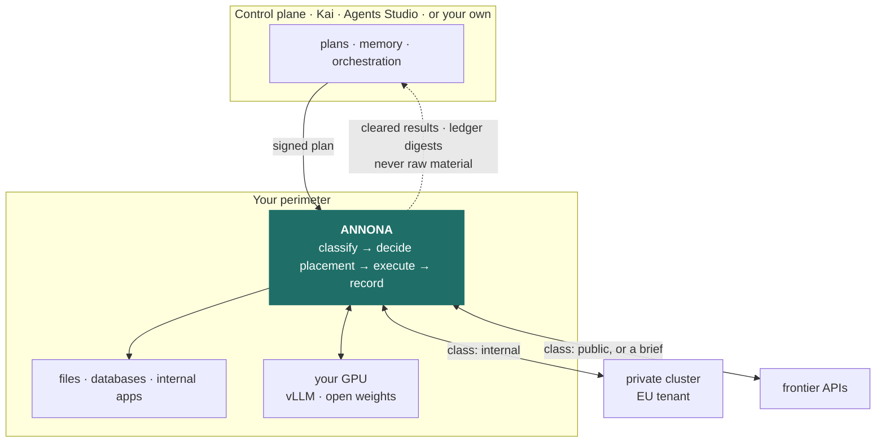
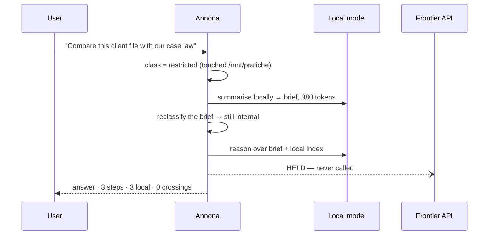

<div align="center">

# Annona

**Where it runs is a decision.**

*an-NO-na* · the office that kept Rome fed

[](LICENSE)
[](#install)
[](.github/workflows/ci.yml)
[](#the-honest-part)

</div>

---

Rome imported its grain. Sicily, Africa, Egypt — the city could not feed itself,
and everyone knew what that meant: whoever controlled the ships controlled Rome.
So the Republic, and then the Empire, refused to leave it to the market. The
***cura annonae*** was a permanent office with a prefect at its head, and its job
was to decide **where the grain came from, which route it took, which granary
held it, and who received it** — and to keep the record of all four.

It was not built out of paranoia. It was built out of arithmetic: **a republic
cannot outsource what it cannot live without.**

Your organisation is now in that position with compute. Every agent you deploy
sends your material somewhere, and "somewhere" is currently decided by whichever
provider a developer typed into a config file eighteen months ago.

**Annona is the office.** It is a daemon you install where your data already
lives, and for every single step of every agent run it decides where that step is
allowed to execute, enforces the decision, and writes it down.

```
$ annona why step_7f3a
step_7f3a  inference  HELD
  class        restricted  (working set touched /mnt/pratiche/2026/BG-114.pdf)
  rule         rules[0]  restricted → [local-gpu], on_unavailable: hold
  candidates   local-gpu (unhealthy: connection refused since 14:02:11)
  not chosen   frontier — max_class public < restricted
               eu-cluster — max_class internal < restricted
  outcome      held at 14:03:07, queued for operator review
  ledger       #418  sha256:9c1f…a7  (chain verified)
```

That refusal is the product. A gateway in the same situation would have quietly
failed over to the frontier API and returned a good answer.

## The argument nobody was having

You have been told to pick one of three architectures: run models **on-prem**
(private, capped by your hardware), call **frontier APIs** (excellent, and your
material leaves), or run **your own weights in your own cloud** (a fine
compromise that costs you an MLOps team).

The industry argues about which column wins. That argument is the mistake.

> **The right column is a property of the request, not of the company.**

Summarising a public tender is not the same problem as reasoning over a client's
medical file, and the second does not become safe because procurement signed a
DPA. One organisation needs all three columns, chosen per step, ten thousand
times a day, by something that can prove afterwards what it chose.

Nothing in the stack does that:

| Layer | Examples | Decides | Cannot |
|---|---|---|---|
| Serving runtime | vLLM, Ollama, TensorRT-LLM | how fast one model answers on one box | anything about *which* box, or about tools |
| AI gateway | LiteLLM, Portkey, Envoy AI Gateway | which endpoint a token stream hits | execute a tool, read a file, classify material, prove anything |
| Agent framework | datapizza-ai, LangGraph | how you *write* an agent | placement — a config line, picked once |
| Sovereign models | Minerva, Velvet, Italia | which weights you may run in Europe | where a given request actually goes |
| **Annona** | — | **where each step runs, whether it may, and what crosses** | replace any of the above — it orchestrates them |

> **The claim, stated so you can falsify it.** Annona is the first open-source
> project in which the **placement of every inference and every tool call is a
> policy decision, enforced by the runtime and verifiable after the fact.** Find
> a project that does this and we will say so here.

## How it works



Annona is deliberately **not** the thing that decides *what* to do. Planning and
memory stay in the control plane — ours, or yours over three HTTP endpoints. The
component that touches your data is the one you can read, and it is small enough
to read. That is the entire trust argument.

Four rules give the picture its teeth:

**Fail closed.** No permitted substrate is available → the step is *held*. Not
downgraded, not rerouted, not "best effort".

**Failover may cost latency, money or model quality. Never jurisdiction.** This
is the one sentence that separates a kernel from a gateway with a fallback list.

**Contamination is monotone.** Once a transcript has touched restricted material
it stays restricted. Tools executing locally is *not* the same as data staying
local — the transcript is the leak, and it travels with the next inference.

**Outbound only.** No listening port on the internet. Nothing to firewall, no
inbound rule to request from a customer's IT department — historically the step
where sovereign deployments die.

## The same plan, two different verdicts

Ask it to compare a client file against your case law:



Now ask the same question about a public tender document. Steps 1 and 3 are
placed on the frontier model, the answer is better, and it costs a tenth as much.

**Same code. Same plan. Different policy verdict.** That is the product.

## Try it in sixty seconds

```bash
git clone git@github.com:akaion-ai/annona.git
cd annona
make setup          # venv + dependencies
make demo           # a real agentic run — no credentials, no network
```

`make demo` is the fastest way to understand this repository. It drives a **real
agentic loop** — real tool execution against real files, real policy checks —
from a scripted backend, so it needs no API key and opens no socket. It shows one
task the policy permits and one it refuses:

```
1 · a task the policy permits
  1. ok      explorer         {'operation': 'map', 'path': '…/documents'}
  2. ok      document_reader  {'path': '…/reports/q1_report.txt'}
     answer  Q1 2026: 142 pratiche aperte, 98 chiuse, 412.000 EUR…

2 · a task the policy refuses
  1. denied  filesystem       {'operation': 'read', 'path': '~/.ssh/id_rsa'}
     → {'error': 'Permission denied for tool: filesystem'}
```

Nothing left the process. The same run is a CI gate on every push
(`python -m runner.demo --check`), so that claim cannot rot.

Then: `make run` starts the daemon and a local UI on `127.0.0.1:7070`. No account
required, ever.

### As an appliance, with a real model

```bash
docker compose up -d                                   # kernel + Ollama, arm64 or amd64
docker compose exec annona-ollama ollama pull qwen2.5:14b
docker compose exec annona annona policy init --endpoint http://ollama:11434 --model qwen2.5:14b
make verify                                            # the acceptance run
```

`make verify` plants a canary in a client file, lets a real agent read it, and
checks the nine things a customer's auditor would:

```
  pass  the local runtime answers
  pass  the model called the tool
  pass  reading a client file made the run restricted
  pass  no payload reached the frontier substrate
  pass  leak rate is zero
  pass  every inference was placed on-prem
  pass  the ledger chain verifies
  pass  the run produced an answer
  pass  with the GPU down, restricted work is held (not rerouted)
```

The last check is the commercial one. Deployment, sizing and the DGX Spark
specifics are in [`deploy/README.md`](deploy/README.md).

### Operating it

```bash
annona policy show             # the policy as the runtime understands it
annona policy test restricted  # where would restricted work go, right now?
annona substrates              # what is registered, where, and whether it is up
annona why step_7f3a           # reconstruct one decision from the ledger
annona verify                  # check the chain, offline, contacting nobody
annona audit --held            # every refusal, with its reason
```

## The policy is a file you own

```yaml
# ~/.annona/policy.yaml
classes:
  restricted:                      # never leaves the walls
    paths:    ["/mnt/pratiche/**", "~/clienti/**"]
    patterns: ['[A-Z]{6}\d{2}[A-Z]\d{2}[A-Z]\d{3}[A-Z]']    # codice fiscale
  internal:
    paths:    ["~/Documents/**"]
  public:
    default: true

rules:
  - match: { class: restricted }
    allow: [local-gpu]
    on_unavailable: hold           # the whole point. No silent downgrade.
  - match: { class: internal }
    allow: [local-gpu, eu-cluster]
    on_unavailable: queue
  - match: { class: public }
    allow: [local-gpu, eu-cluster, frontier]
    prefer: cost
```

A DPO can read that in one sitting, which is the design constraint. Full schema,
placement algorithm and the state machine behind it:
**[`docs/design/hld.md`](docs/design/hld.md)**.

## Where it runs

Three topologies, **one binary, one release**. They differ in configuration —
which substrates are registered and what the policy permits — never in code. A
fork per deployment is how sovereignty claims rot, so there isn't one.

| | **Detached** | **Attached** | **Appliance** |
|---|---|---|---|
| Hardware | laptop, Mac mini in a cupboard | any server | DGX-class, or EU colocation |
| Control plane | none — local plans and CLI | Agents Studio, outbound only | Agents Studio |
| Inference | local runtime only | local + remote, by policy | local (vLLM), remote by exception |
| Users | one | one | many, per-user policy |
| Network | may be fully air-gapped | outbound 443 only | outbound 443 only |

Detached means detached: no account, no remote host, no outbound connection at
all. It is the configuration we expect a fork to start from.

On a **DGX Spark** the appliance runs Annona and vLLM under one compose file
(`--profile vllm`), with the daemon unprivileged and only vLLM touching the GPU.
Two things appliance vendors usually skip, stated up front: every image must be
`linux/arm64` + CUDA 13 — x86 images silently do not run on a GB10, so the
release matrix builds and tests both — and the real ceiling is memory bandwidth,
not the 128 GB. See [`deploy/README.md`](deploy/README.md) and
[HLD §7.2](docs/design/hld.md#72-the-appliance-on-a-dgx-spark), including what
GPU attestation does *not* buy you on that hardware.

## What is built, and what is not

This project publishes its gaps, because a perimeter you cannot verify is a
slogan.

**Built and under test.** Classification (paths, symlink targets, content
patterns, and paths named in a prompt), the monotone working set, a default-deny
tool gate, the placement engine with its conformance matrix, substrate health
with a circuit breaker, failover that cannot widen the permitted set, locally
produced briefs that are reclassified before they may cross, a hash-chained
ledger with `verify` / `why` / `audit`, an arm64 + amd64 container image, and a
nine-check acceptance run for a new appliance.

```
$ make contracts
L0 kernel does not depend on outer layers                    KEPT
L3 agent depends only inward on L0                           KEPT
L3 agent and L1 capability do not know about each other      KEPT
L0 kernel imports no provider SDK                            KEPT
L3 agent loop imports no provider SDK                        KEPT
L2 policy depends only inward on L0                          KEPT
L2 placement depends on policy and the kernel, never outward KEPT
L2 audit depends on nothing but the kernel                   KEPT
L2 policy, placement and audit cannot reach an L1 adapter    KEPT
L2 imports no provider SDK                                   KEPT
```

The last four are why "failover cannot widen the permitted set" is structural: a
shortcut from the decision layer to an adapter is not a code review away, it is
a build failure.

**Not built.** Stated as plainly as the rest:

| Gap | Today | Phase |
|---|---|---|
| **Grammar-constrained tool calls** | small models are asked politely; malformed arguments become a tool error the model can retry from | F1 — the research claim |
| **The ledger has no external anchor** | tamper-evident against edits, deletions and reordering; a chain rebuilt wholesale by someone with write access is not detectable | F3 |
| **Queued steps are not resumed automatically** | `on_unavailable: queue` records the decision; retrying is manual | F2 |
| **The legacy config path is still allow-by-default** | an installation without a policy keeps the old permission manager; `annona policy init` is what switches it | F1 |
| **Vault metadata is not portable** | markdown holds the body; titles, tags and sync state live only in SQLite | F3 |
| **No measured leak rate at scale** | zero over the acceptance corpus and the live model tests; the 1 000-step number is not run yet | F2 |

Each has a metric and a target rather than a promise —
[HLD §9](docs/design/hld.md#9-verification-the-numbers-this-design-lives-or-dies-by)
and [`docs/research/index.md`](docs/research/index.md), where negative results get
published too.

## The trust boundary

Annona is open source on purpose. It is the component that sees your material, so
it must be the component you can audit — and replace.

| | **Annona** (this repo, Apache-2.0) | **Agents Studio** (hosted, proprietary) |
|---|---|---|
| Decides *what* to do | no | yes — plans, versions, fleet |
| Decides *whether it may*, and *where* | **yes, and it is the only one that does** | no |
| Sees raw material | yes, and does not let it leave | never |
| Runs where | your machine, your rack, your appliance | EU cloud |

Point it at your own backend by implementing three endpoints — verify a token,
receive pushed notes, optionally serve inference — or set `ai.provider: local`
and skip the third entirely. Details in
[the trust boundary section of the HLD](docs/design/hld.md#6-control-plane--data-plane-contract).

## Documentation

| | |
|---|---|
| [**High-level design**](docs/design/hld.md) | the design of record: components, placement algorithm, DGX appliance, threat model, metrics, acceptance run |
| [Architecture as built](docs/design/architecture.md) | only the code that exists today |
| [Sovereign runtime](docs/design/sovereign-runtime.md) | the threat model in full |
| [Research](docs/research/index.md) | what we are trying to prove, and the numbers |
| [Decisions](docs/adr/index.md) | why it is shaped this way, including the ones we reversed |

## Contributing

```bash
make check            # lint · types · contracts · tests — exactly what CI runs
make docs-serve       # documentation at 127.0.0.1:8000
make                  # list every target
```

Two things worth knowing before your first PR:

- **Do not mock a vendor SDK in tests.** Use the `echo` backend and drive the loop
  through its ports — see `tests/test_agent_loop_unified.py`.
- **If you touch the trust boundary** — permissions, placement, egress, the
  ledger — say in the PR description what a reviewer should check to convince
  themselves the boundary still holds. Not "I tested it": *what to look at*.

[`CONTRIBUTING.md`](CONTRIBUTING.md) · [`SECURITY.md`](SECURITY.md) ·
[`CHANGELOG.md`](CHANGELOG.md)

The Firebase Web API key in `auth.py` is the project's documented public default;
Firebase Web SDK keys are designed to be client-visible.

---

<div align="center">

**Annona** is built by [**Akaion AI Lab**](https://akaion.com) on
[datapizza-ai](https://github.com/datapizza-labs/datapizza-ai) (MIT), because the
world does not need a fourth agent framework — it needs the part underneath.

Apache 2.0 · [`LICENSE`](LICENSE) · [`NOTICE`](NOTICE) · Copyright 2026 Akaion

</div>
